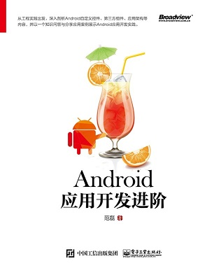
## 简介
AndroidPlus为《Android应用开发进阶》实战项目，分为Java版和Kotlin版。AndroidPlus是安卓开发者的“自留地”，为安卓开发者提供专属的技术问答和知识分享平台。在AndroidPlus上，可以提出在安卓开发过程中遇到的任何问题，可以热心回答其他开发者的疑问，另外还可以分享阅读过的优秀干货文章。

## 功能
AndroidPlus主要分为四大块：注册登录、首页、文章、我（个人中心）。用户首先进入的是注册登录模块，当用户打开App时，会显示一个欢迎界面，若用户没有登录，则进入登录界面。用户没有注册账号，还可以点击注册按钮进入注册界面。用户注册登录后就进入主界面。主界面分为三大模块，分别为首页、文章和我，点击底部导航条可以进行三个模块的切换。主界面默认显示为首页，在首页中，用户可以添加问题，并可分为三个页面：最近问题列表、热门问题列表和最新回答列表。当用户点击最近问题列表或者是热门列表的问题条目时，会进入问题详情页面，在问题详情页面中，可以添加对问题的回答，并且显示最近回答列表和最热门回答列表；当用户点击回答列表的回答条目时，就会进入回答详情；在回答详情页面中，用户可以点赞或者是跳转到评论界面查看评论或者写评论。在文章界面，根据文章类别可分为热门、思考、项目、SDK、Kotlin、自定义控件、第三方、面试，并且可以在别的应用中分享文章到AndroidPlus。在个人中心——“我”中，会显示用户的相关信息，如头像、昵称、个性签名，另外可查看用户的分享、提问、回答、喜欢的文章、喜欢的问题、喜欢的回答，用户可以在用户反馈中跟产品运营反馈问题，在设置选项中可退出登录。
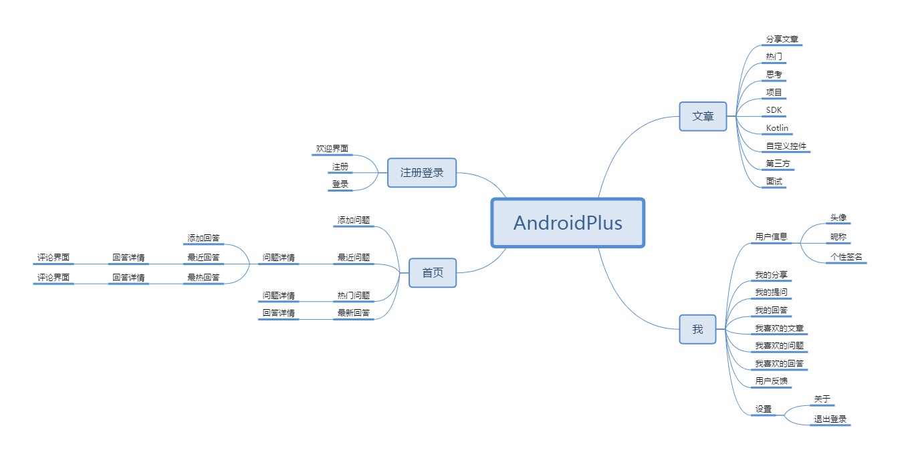

## 架构设计
AndroidPlus的架构采用MVP + Dagger + LeanCloud。使用MVP将程序划分层次，使用Dagger来降低MVP中层与层之间的耦合，作为个人开发者，独自搭建后台服务器比较耗时，可以选择第三方云数据库来完成产品的快速实现。在MVP的Model层中，我们进行了模块化处理，将数据源进行切割，分成了问题数据源QuestionDataSource、回答数据源AnswerDataSource、评论数据源CommentDataSource、文章数据源ArticleDataSource。在当前版本中，数据源由LeanCloud实现，如果后续更换服务器接口（比如使用自己搭建的服务器），只需要用新的网络接口实现Model层的一套数据源接口，替换掉LeanCloud即可。

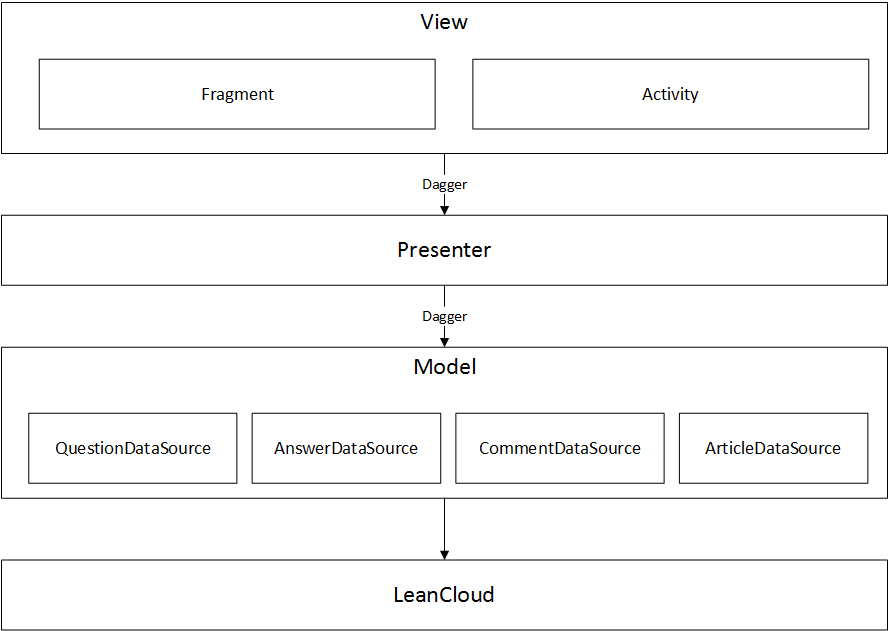

## 实现
### 注册和登录（RegisterActivity和LoginActivity）
 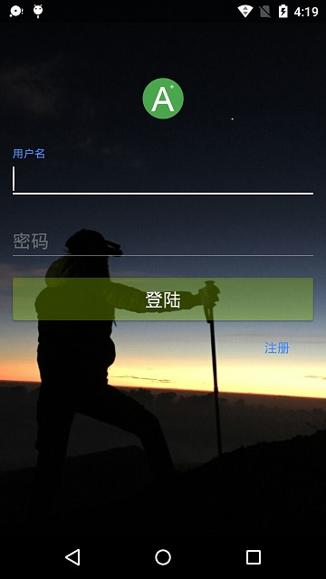
### 主界面 (MainActivity)
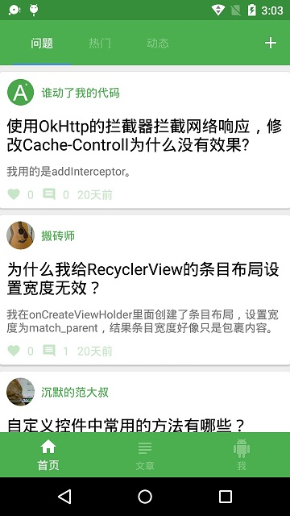
### 首页 (HomeFragment)
首页界面顶部为Toolbar，并内部包含一个TabLayout，Tablayout显示三个页面标题：问题、热门、动态。另外TabLayout绑定一个ViewPager，ViewPager内部又有三个子界面：问题界面，热门界面，动态界面。用户点击首页右上角，可进入添加问题界面。

* 添加问题 （AddQuestionActivity）

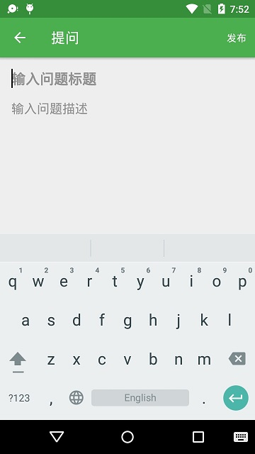

*  问题界面（QuestionFragment）

添加问题成功后，在LeanCloud后台就存在问题数据了，接下来就可以使用QuestionFragment来展示这些数据。问题列表条目进行了模块化封装，为一个QuestionItemView：

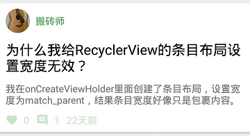

*  热门界面 (HotQuestionFragment)

热门界面根据用户对问题收藏次数进行排序展示。

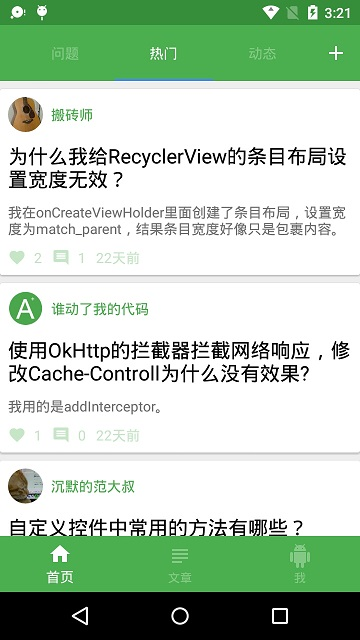

* 动态界面 (DynamicFragment)

动态界面展示最新被回答的问题列表

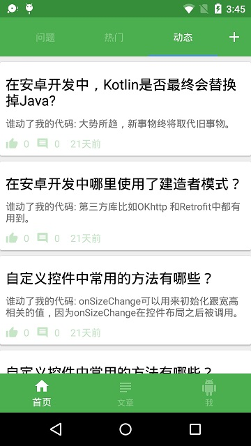

### 问题详情（QuestionDetailActivity）
当我们点击问题界面和热门界面的条目时，就能跳转到问题详情界面。问题详情显示问题标题与描述，下面是一个ViewPager展示最新的回答和最热门的回答列表。

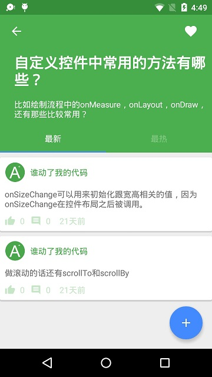

### 添加回答（AddAnswerActivity）
在问题详情界面，点击右下角的FloatingActoinButton跳转到添加回答界面AddAnswerActivity，用户可以在里面输入自己对问题的回答，然后点击右上角的发布按钮进行发布。

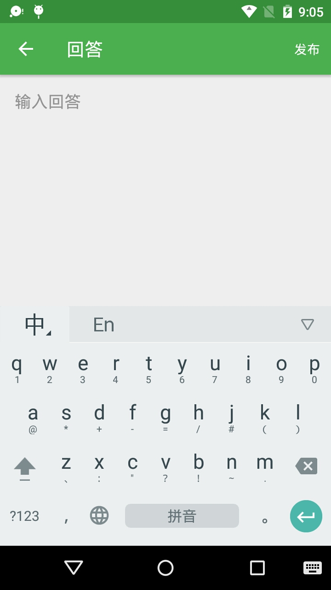

### 回答详情（AnswerDetailActivity）
点击问题详情中的回答条目AnswerItemView，进入回答详情AnswerDetailActivity，在问题详情界面AnswerItemView中的回答可能展示不全，回答详情界面展示回答所有内容，并且在底部可以对回答进行点赞和评论。

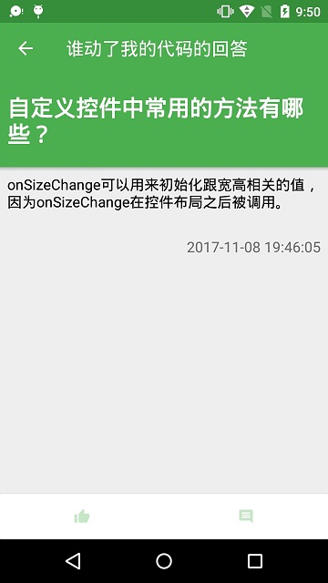

### 评论（CommentActivity）
点击回答详情的评论按钮，进入评论界面CommentActivity。评论列表由RecyclerView实现，滚动到底部时，可加载更多评论数据。

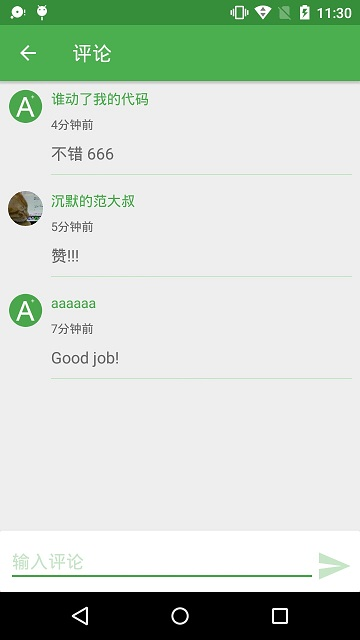

### 分享文章（ShareArticleActivity）
当用户在其他应用中读到精彩Android开发的文章时，可以点击分享按钮，在弹出的应用列表中选择AdroidPlus（应用名Android+），跳转到分享界面ShareArticleActivity。在ShareArticleActivity中，文章的URL自动填写出来，文章的标题和描述需要用户自行输入，然后还必须给文章选定一个标签，才能够发布文章。
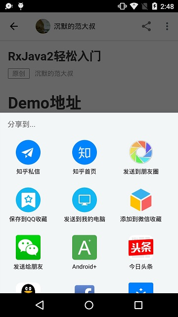

### 文章界面（ArticleFragment）
完成文章分享后，我们就可以在文章界面ArticleFragment查看用户分享的文章了。在ToolBar中包含TabLayout，里面放置着文章标签：热门、思考、项目、SDK、Kotlin、自定义控件、第三方和面试。TabLayout与ViewPager绑定，每个标签对应一个文章列表的Fragment,点击文章列表条目，就能够进入文章详情，查看文章内容，并且可以收藏喜欢的文章。

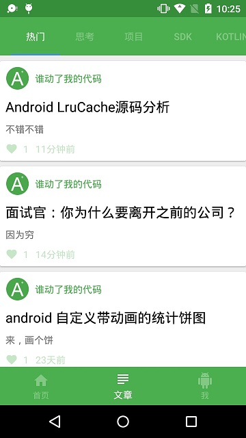

### 个人中心（MeFragment）
主界面的最后一个页面是个人中心MeFragment。第一个卡片里面摆放用户头像、用户名和用户签名，点击都能进行修改；第二个卡片摆放用户的分享、提问和回答；第三个卡片是用户喜欢的文章、问题和回答；第四个卡片在最后面，摆放着用户反馈和设置。

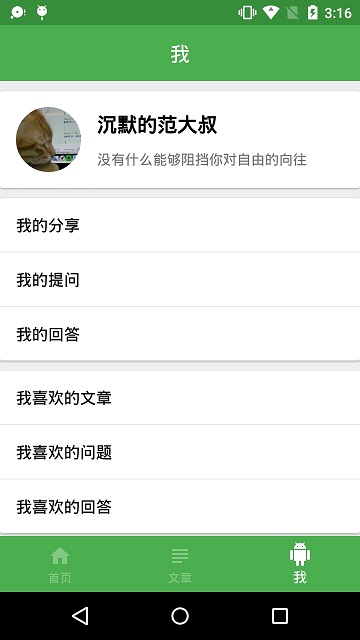

* 我的分享

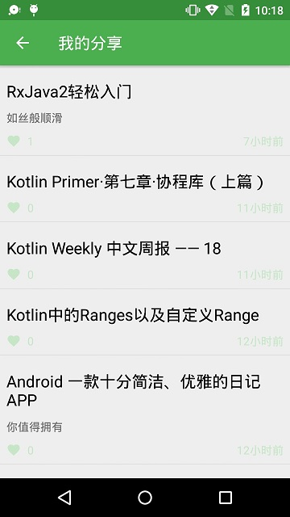

* 我喜欢的文章

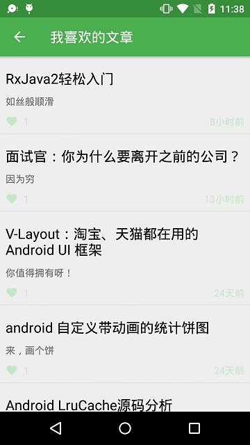

* 用户反馈

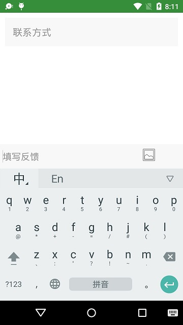

### 用户详情（ProfileActivity）
展示的是当前登录用户的数据，如果想查看其他用户的数据怎么办呢？事实上，我们可以点击问题列表或回答列表条目中的用户的头像或用户名即可跳转到用户详情界面ProfileActivity。

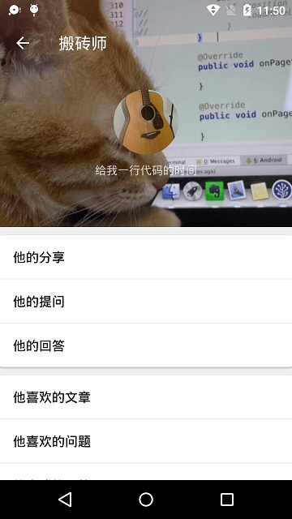

## 交流
更多详细内容请查阅[《Android应用开发进阶》](https://item.jd.com/12347729.html)，另外，欢迎各位朋友加入QQ群，交流项目学习。

